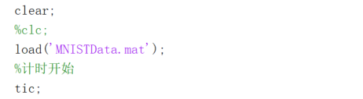
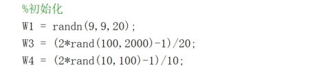
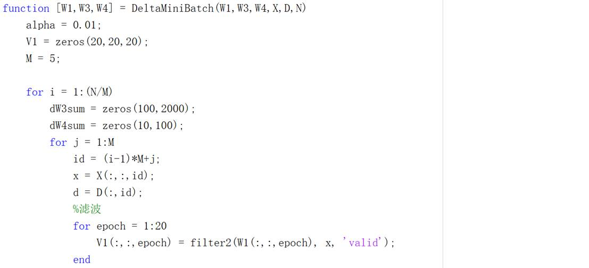
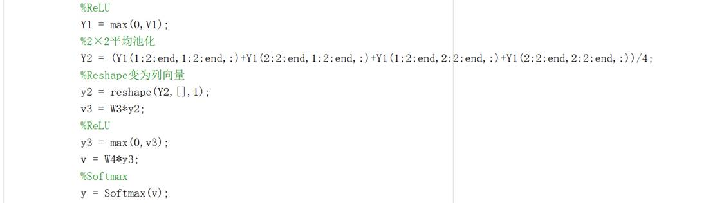
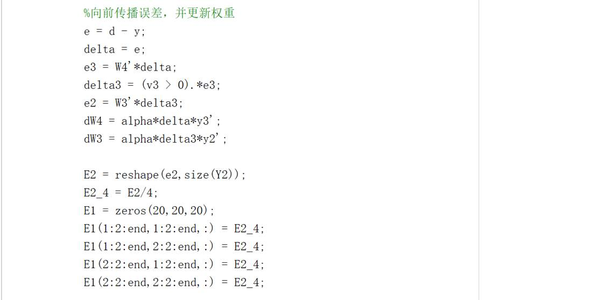
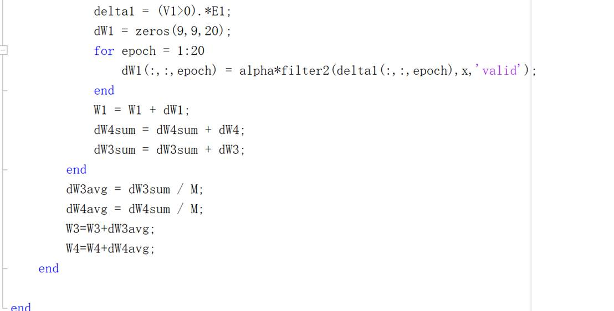
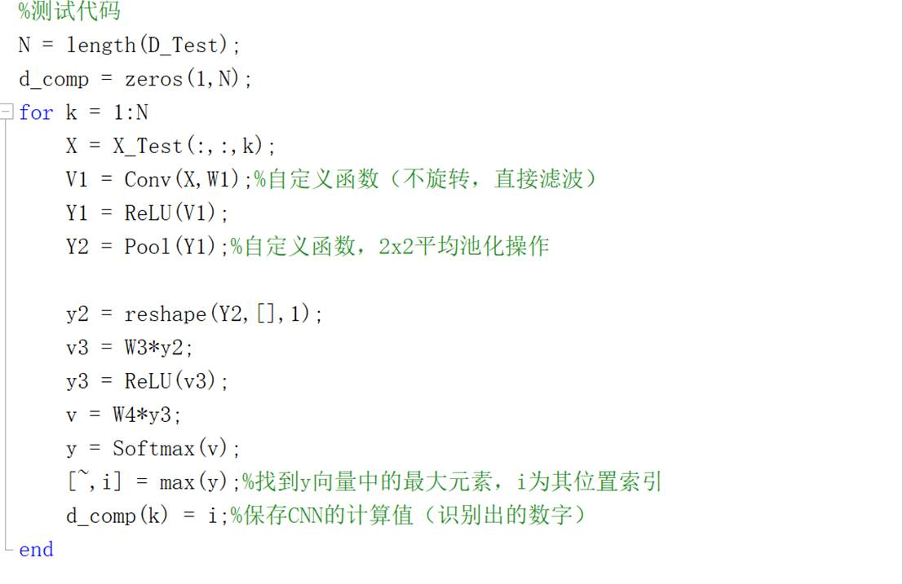
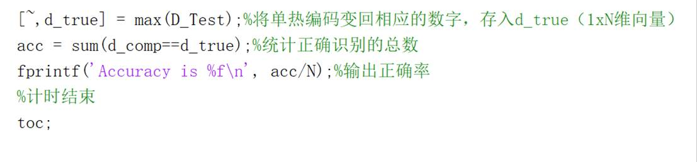

# MINST-CNN
基于MINST数据库的手写体数字识别CNN设计，matlab实现

## 网络设计

**特征提取子网络：**

​    训练数据为28×28，像素值归一化为[0~1]的图像。经过9×9×20的滤波器矩阵滤波过后，提取出20×20×20的FeatureMap矩阵。将得到的特征矩阵经过ReLU激活函数后，求得Y1，Y1经过2×2的平均池化后，降低图像维度，得到Y2。

**分类子网络：**

​    分类子网络中采用“交叉熵+Softmax”和小批量算法的方法对数据进行训练，Y1经过Reshape函数转化为列向量，得到y2。y2再输入进分类子网络中。分类子网络采用BP策略，将误差向后传播，并更新网络中的权重值。

## 训练和调试方法

**训练：**

**1.**   **载入训练数据，并设置时钟，记录运行时间**

**2.**   **初始化权重值**

**3.**   **采用小批量算法对神经网络进行训练，60000个样本，分12,000组，每组5个。总共更新12000次权重值**

**4.**   **载入测试数据，并将输出结果与真实结果进行对比，统计识别的正确率。同时暂停时钟，输出程序运行时间**

 